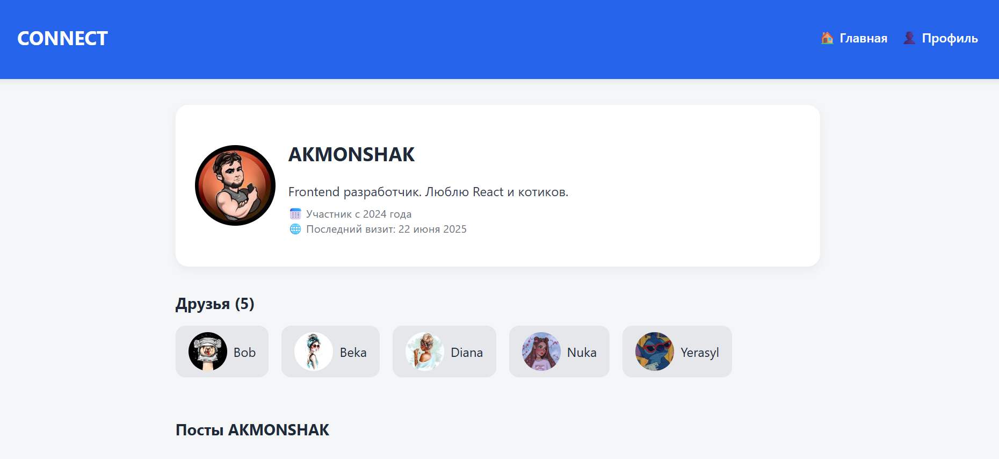

# 🧑‍🤝‍🧑 CONNECT — Мини-социальная сеть на React

**CONNECT** — это простое приложение социальной сети, написанное на React. Оно позволяет публиковать посты, ставить лайки, просматривать профили и список друзей.

## 📸 Скриншот



## 🚀 Возможности

- 🏠 Главная страница с лентой постов  
- ➕ Создание новых постов  
- ❤️ Лайки для постов  
- 👤 Профиль пользователя с аватаром и биографией  
- 🧑‍🤝‍🧑 Список друзей с переходом в профиль  

## 🛠️ Технологии

- React (Create React App)
- React Router
- useState
- CSS (без внешних UI-библиотек)

## 📂 Структура проекта

```
/src
  ├── App.js          # Основной компонент с маршрутизацией
  ├── App.css         # Стили
  └── index.js        # Точка входа React-приложения
```
## 🌐 Демонстрация

--> https://yerassy1106.github.io/profile/1](https://yerassy1106.github.io/socialmedia/)](https://yerassy1106.github.io/socialmedia/

----
## 👨‍💻 Автор

**Erasyl **  


---


